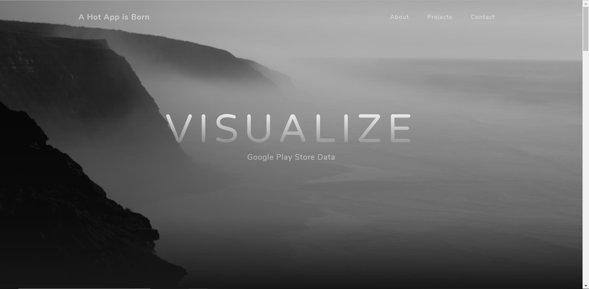

# A Hot App is Born - Visualize Google Play Store Data

**Authors**:
Yijun Chen(yc3166),Chaochen Wu(cw2661),Qi Sun(qs479,Online）

Description:
In our project, we assume there’s a company wants to develop a mobile App which will create great benefits. 
This company don’t have any experience of App developing, but they want to find out what makes an App popular. 
They need us to do marketing research for them. We use information visualization techniques to analyze the data 
set for the current market. 
